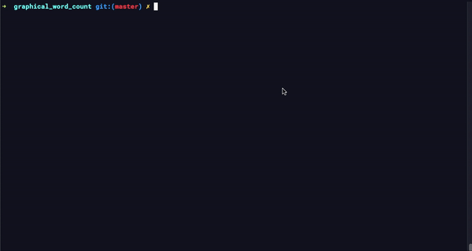

## Basic Overview

Interpretation of the unix program word count (wc) with graphical user
interface.



**Usage**

---
```
Example made using gcc compiler
gcc gwc.c -o gwc

Usage: ./gwc <input_file>
```
---
